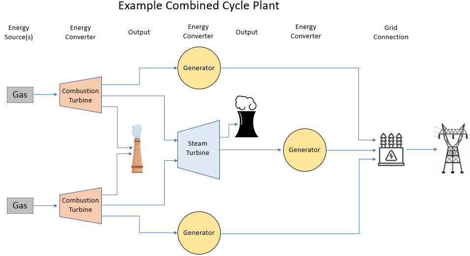

# epacems_ramp_rates

Characterization of power plant maximum ramp rates (in MW/hr) using hourly EPA CEMS data.

## Installation

1. Create a new virtual environment with python>=3.8
2. clone this repo
3. `cd` to the repo root
4. run `bash install.sh`

The data source is the EPA CEMS dataset as defined by the [catalyst-cooperative/pudl](https://github.com/catalyst-cooperative/pudl) repo. The `install.sh` script downloads several GB of the latest data for you. 

## Usage

To create .csv files with the results of this analysis, use the CLI:`$ calc_ramps MY_OUTPUT.CSV`. See `--help` for details about optional arguments like analyzing a subset of states or years. The script takes about 1.5 minutes per year of data to run.

For interactive use in a jupyter notebook, see the example in notebooks/8.0-tb-example_of_interactive_use.ipynb. Notebooks 0.0 to 7.0 were used for development and are not well documented.

## Methodology

Ramping capacity depends on the time scale of interest (some plants need several hours of advance notice to reach their maximum ramp rate, some need only minutes) and also depends on economically-driven plant operations (a plant already running at max capacity cannot ramp up, for example). With only generation timeseries, it is not possible to completely separate physical constraints from economic/behavioral constraints on ramping. But because economic conditions change over time, whereas physical constraints are mostly static, we can estimate physical constraints by looking at the extrema over a period of time. The assumption here is that economic constraints were negligible at some points in time, and at those times the underlying physical constraint will be revealed.

This analysis attempts to characterize maximum ramping capacity available on an hour-ahead time scale. This process consists of three main steps: cold start/stop exclusion, identifying distinct plants, and aggregating/summarizing.

### The cold start problem

Some types of power plant, like steam turbines and some combined cycle plants, take several hours to turn on and ramp up to a stable operating level. This is called a 'cold start'. Cold starts are a problem for hourly analysis because they contain very high ramp rates, but are not dispatchable on an hourly basis due to their lead time. A analogous problem exists for complete shutdowns, which feature the most extreme ramp rates of all but shorter lead times.

To exclude these startup/shutdown events, I filter for ramp rates that occur when the plant is at least N hours away from the nearest 0 generation value. I have defined N, the exclusion duration, based on empirical startup duration estimates aggregated by plant type (steam: 5 hours, combined cycle: 7 hours, gas turbine: none). See `ramprate.build_features.EXCLUSION_SIZE_HOURS` to see more details or edit these values.

This filter is not perfect. Occasionally a startup ramps to and lingers at a very low generation value, but not zero, before continuing with the startup process. Some unusual downtime events produce steep ramp rates that exit the normal stable operating band of generation, but don't come close to 0. I'm not sure if those events are data errors or operational hiccups or emergency ramping capacity. There are many methods to address these exceptions but I ran out of budget to address them. Erroneous ramps will manifest as overestimated extrema.

### Identifying plants

EPA CEMS data combines information from several parts of a power plant: emissions from smokestacks, fuel use from combustors, and electricty production from generators. But smokestacks, combustors, and generators can be connected in complex, many-to-many relationships, and plant_ids often contain multiple independent facilities, making aggregation to any of those units difficult or inappropriate.

Instead, I identify plants by analyzing the relationships between combustors and generators as provided in the [EPA/EIA crosswalk](https://github.com/USEPA/camd-eia-crosswalk). In graph analysis terminology, the crosswalk is a list of edges between nodes (combustors and generators) in a bipartite graph. The networkx python package provides functions to analyze this edge list and extract disjoint subgraphs (collections of combustors and generators that are connected to each other). These are distinct power plants (not to be confused with plant_id, which refers more to a plot of land than to a particular energy converter). To avoid a name collision with plant_id, I term these collections 'connected components' or 'components' for short, and identify them with a component_id.

Through this analysis, I found that 56% of plant_ids contain multiple independent components at the same location. 11% contain multiple independent components with different technology types, such as a coal boiler and gas turbine.

### Aggregation

Generation timeseries are filtered at the EPA unit level then aggregated (summed) to the component level. Max ramp rates are calculated on this component-level timeseries.

Categorical metadata like turbine type and fuel type are also aggregated to the component level. These categories are homogeneous within 99+% of components, but when they are heterogeneous, the category with highest associated capacity is chosen as the aggregate value.

## Limitations

1. EPA emissions data only exists for plants that create emissions (combustion-based plants). Nuclear and hydro plants, for example, are not included.
2. Hourly CEMS data is sufficient to resolve ramp rates *only* for slow-ramping plant types like steam turbines and combined cycle plants. I left ramp rate estimates for fast-ramping gas turbines and internal combustion units in the output file, so it is up to the user to replace them with something more appropriate, such the plant max capacity.
3. The cold start/stop exclusion process is not perfect. Because maxima are so sensitive to outliers, cold starts that slip through the filter can impose a strong upward bias on effected max ramp rate estimates. When aggregating, I recommend using a robust estimate like a median instead of a mean.
4. The EPA gives steam turbines the option of reporting either electrical generation or steam production. This includes the heat recovery steam turbines in combined cycle plants. 120 units (out of about 3300) elected to report steam production only, and they are not currently included in this analysis. 111 are independent steam turbines; their max ramp rate estimates are present in the output as 0.0 values. 9 are steam turbines connected to other components, like in a combined cycle; their generation is simply missing from the total output and will thus distort ramp rate estimates for those facilities.
5. System-wide ramping capacity is not equal to the sum of plant ramping capacities due to correlated operation, among other things. No attempt has been made to answer this separate question.

## Project Organization

    ├── LICENSE
    ├── notebooks/            <- Jupyter notebooks. Naming convention is a number (for ordering),
    │                         the creator's initials, and a short `_` delimited description, e.g.
    │                         `1.0-jqp-initial_data_exploration`. 
    │
    ├── requirements.txt     <- The requirements file for reproducing the analysis environment, e.g.
    │                         generated with `pip freeze > requirements.txt`
    │
    ├── setup.py             <- makes project pip installable (pip install -e .) so src can be imported
    │
    ├── install.sh           <- download and extract source data, install package
    │
    ├── src/ramprate         <- Source code for use in this project.
    │    ├── __init__.py     <- Makes ramprate a Python module
    │    │
    │    ├── load_dataset.py <- module to download or read data
    │    │
    │    ├── cli.py          <- module to analyze CEMS data and write outputs to csv
    │    │ 
    │    ├── build_features.py <- module to turn raw data into features for modeling
    │    │
    │    └── visualize.py    <- module to create exploratory and results oriented visualizations
    │
    ├── results/             <- example output for 2015 - 2019, all states
    │    ├── output_2015-2019.csv     <- results of analysis of CEMS data from 2015-2019, inclusive.
    │    │
    │    ├── output_2015-2019_crosswalk_with_IDs.csv <- EPA crosswalk with `component_id` column added.
    │    
    ├── tests/               <- a handful of tests. This project is not well tested.
    │    
    └── data_in/             <- destination directory for install.sh data download/extraction

--------
